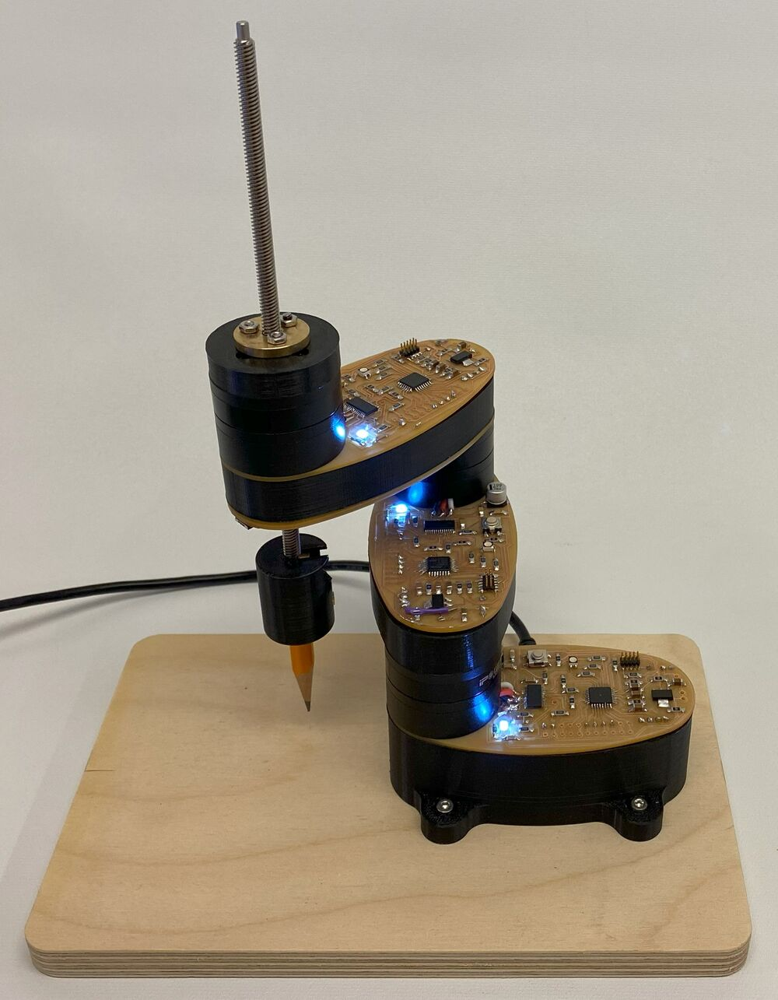
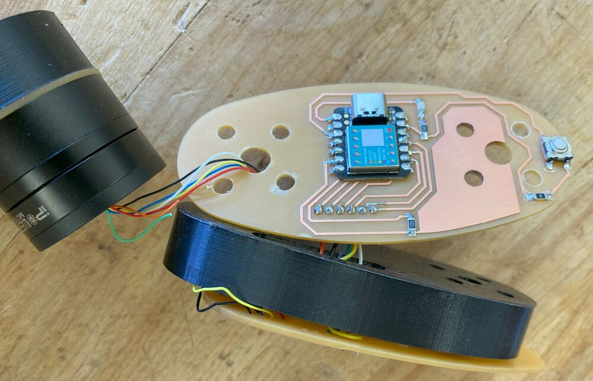
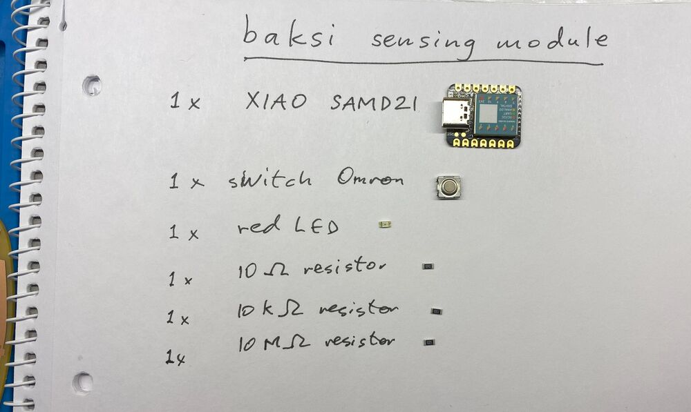
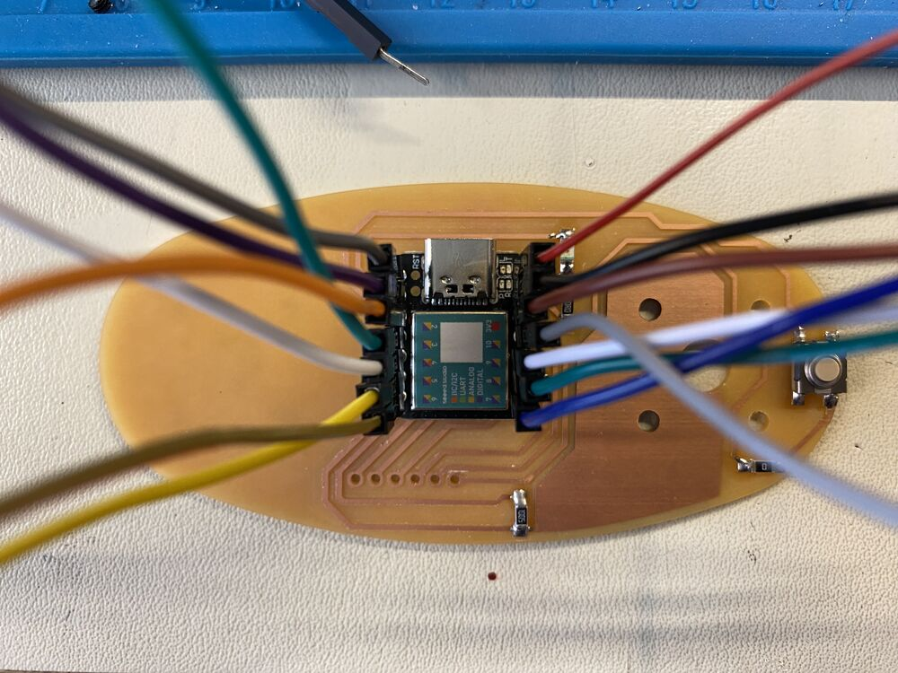
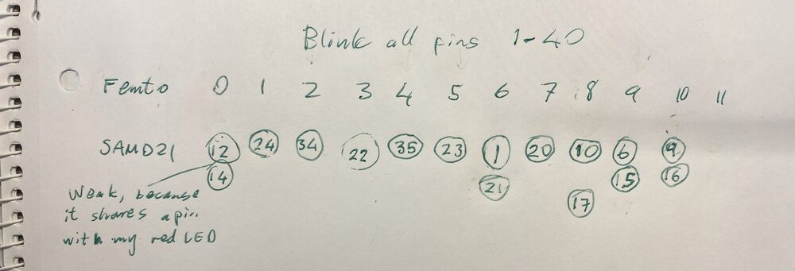
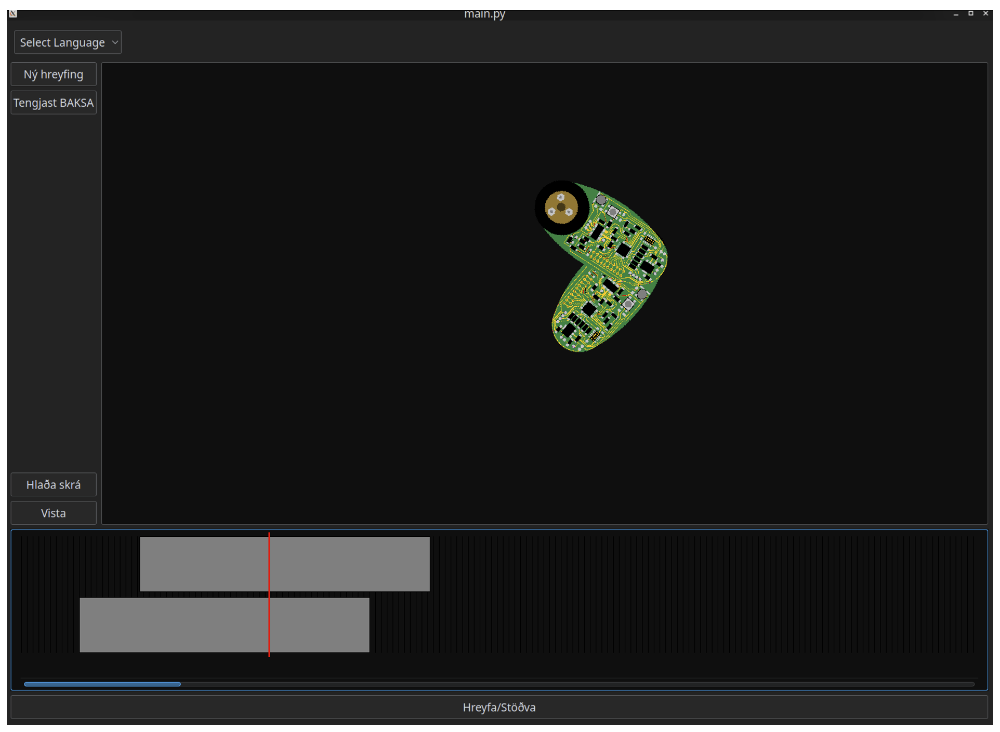

# My experience with Seeed Studio

{: style="width:100%"}*My name is Svavar Konráðsson and I work at [Fab Lab Ísafjörður](https://www.google.com/maps/place/Fab+Lab+%C3%8Dsafj%C3%B6r%C3%B0ur,+innovation+center/@65.046614,-21.7431544,620021m/data=!3m1!1e3!4m6!3m5!1s0x4f2b1fcc2e461a1d:0xc9bdd97229cc149e!8m2!3d66.0738941!4d-23.1316709!16s%2Fg%2F11b6t85p8k?entry=ttu), Iceland.*

## Fab Academy

[{: style="width:100%"}](https://fabacademy.org/)

I took part in the [Fab Academy](https://fabacademy.org/) in 2023 and I have to say, the experience changed me for the better. I no longer feel intimidated by any technology, and my project management skills have improved. The Fab Academy is taught remotely by Professor Neil Gershenfeld, director of the MIT Center for Bits and Atoms. Neil is the originator of the Fab Lab movement. My local instructor at our lab was the multi-talented [Þórarinn Bjartur Breiðfjörð Gunnarsson](https://fabacademy.org/archives/2015/eu/students/gunnarsson.thorarinn_b.b/index.html), director of Fab Lab Ísafjörður.

{: style="width:100%"}*The evolution of my electronics design skills over the course of the Fab Academy. The course puts a heavy emphasis on digital electronics, because that's what makes things come alive!*

You'll notice Xiao modules being heavily used throughout my electronics work. They are recommended by the Fab Academy, which has traditionally only used bare microcontrollers. The Xiao modules are incredibly handy, since I can put pin headers on them and try things out on a breadboard, and then embed them in my own custom circuits. They have a built-in USB-C connector (it's not easy to mill the pads for those connectors) and an RGB LED which I've used to confirm that my PWM motor control code is working (see [here](https://svavarkonn.github.io/MkDocs/seeed.html#led-pwm-test)). If I want good analog peripherals to connect to sensors (like in my [IR sensor](https://svavarkonn.github.io/MkDocs/seeed.html#ir-sensor-board) and my [Baksi sensing board](https://svavarkonn.github.io/MkDocs/seeed.html#sensing-board)), I'll use the Xiao SAMD21, if I want raw processing power, I'll use the Xiao RP2040 and if I want WiFi networking I'll grab the Xiao ESP32. And more Xiaos have been added; it would be fun to try a bit of machine learning on a microcontroller module.

Here's the concept sketch of my Fab Academy final project, a tiny and simple educational robot arm made only of motors and PCBs:

{: style="width:100%"}

Baksi (I added the "i" at the end because my son always calls it Baksi) is the noun version of the Icelandic verb baksa, which means to 'busy oneself' or to 'be industrious', usually in the context of toddlers playing energetically outside, digging and dragging logs about and throwing rocks. [Here's a video](https://vimeo.com/806145840#t=9m5s) where I describe the final project to Neil Gershenfeld during random review.

#### A bit of history
I backed the original [uArm on Kickstarter](https://www.kickstarter.com/projects/ufactory/uarm-put-a-miniature-industrial-robot-arm-on-your) and enjoyed using it until I accidentally connected the power supply directly to the Arduino instead to the uArm Shield. The plan was to have it [fry doughnuts and frost them](https://hackaday.io/project/1172-uarm-vending-machine) but the arm ended up getting fried instead. The software part also intimidated me.

In one of the courses in my Mechanical Engineering degree, the task was to pick up a wine glass and give the professor a sip. The rationale behind it was to think about solutions for people with Parkinson's disease. [My group](https://gitlab.fabcloud.org/academany/fabacademy/2023/labs/isafjordur/students/svavar-konradsson/-/raw/main/docs/images/building_skenkir.jfif) put a lot of work into making a [robot arm](https://gitlab.fabcloud.org/academany/fabacademy/2023/labs/isafjordur/students/svavar-konradsson/-/raw/main/docs/images/skenkir.jfif) with a soft 3D printed hand that I found on Thingiverse. We converted an old theatre light (if you find one, they're a treasure trove, this one had 13 stepper motors). I designed and 3D printed all the custom components and [the arm worked](https://www.youtube.com/embed/fERCV8JCrM8).

But then I wanted an arm that can do more than one thing. When Fab Lab Ísafjörður needed something to impress the President of Iceland and the First Lady, [Karítas](https://fabacademy.org/2018/labs/fablabreykjavik/students/karitassigurbjorg-bjornsdottir/) at [Fab Lab Sauðárkrókur](https://www.facebook.com/fablabsaudarkrokur/) was kind enough to loan us a [Niryo One](https://niryo.com/fr/product/niryo-one/), a 3D printed educational robot arm based on steppers and [Dynamixel](https://www.robotis.us/dynamixel/) servos. I programmed the robot to [hand the First Lady a laser cut business card](https://www.vestfirdir.is/is/vestfjardastofa/frettir/forsetahjonin-i-heimsokn), and had great fun experimenting with the robot. Then I fried one of its servo motors when a cable connector got stuck and the robot kept trying to move to its intended position. I managed to swap out the motor, but I thought that surely there's an improvement to be made here. 

Since educational robot arms seem to be mostly used to move colored cubes around, I think it's OK to scale them down and simplify them to make them less expensive and more accessible. I'd like to base my arm on brushless motors without any gearing, and use springs to balance it, just like the [Anglepoise lamp](https://en.wikipedia.org/wiki/Anglepoise_lamp). Then it's nimble and can't damage anything. It won't be able to lift much, but that's OK! I only want it to lift a paint brush or a colored cube.

#### Outline of the idea
Since I have a history of frying robot arms, I have a few personal design goals for my arm.

- Cannot hurt itself or the user
- Easily programmed by moving the arm and saving key points and paths
- Small
- Cheap
- Precise enough to paint candles for a local company :)

#### I present Baksi the educational robot!

{: style="width:100%"}

I ended up changing to a SCARA design, since it doesn't stress the motors as much. I also 3D printed a part to put underneath each PCB to stiffen it and hide a bunch of wires. Here's my fun 1 minute final project video, showcasing Baksi the robot:

<video controls width=100%>
        <source src="https://fabacademy.org/2023/labs/isafjordur/students/svavar-konradsson/presentation.mp4" type="video/mp4">
    </video>*I'd love to show Baksi the robot arm at Maker Faire Shenzen and discuss how to adapt the design for manufacturing.*

I'm planning to have Seeed Studio fabricate the boards for the next version of the Baksi robot arm. That version will be made of motors and PCBs and nothing else! A professionally produced FR4 PCB will be much stiffer than the FR1 boards that I milled, and when I order them from Seeed Studio I can use multiple layers to route all the wires that I need. I've checked, and the main parts (MCU and motor driver) are available in the Seeed Studio part catalogue. I also think Grove connectors for the motors and encoders would be really nice. If there's interest, it would be exciting to also try to sell the robot as a kit in the Seeed Studio store. I really want to take this robot all the way to market, so that it can be used to teach electronics, robotics and programming in a fun and engaging way. I even got a friend of mine to make a [GUI for Baksi](https://svavarkonn.github.io/MkDocs/seeed.html#baksi-software). Exciting times ahead!

## My first circuit

I designed my first electronic circuit in January 2023. It was a Xiao RP2040, a button and a blue LED with a current-limiting resistor.

{: style="width:100%"}

I calculated the correct value for the resistor, opened up KiCAD for the first time, watched a few tutorials and then exported the design as an SVG file. I edited the design in Inkscape and cut it out of some adhesive-backed copper sheet and glued it to a laser cut plate. I tried my hand at soldering the SMD components (the Xiao was easy to solder) and then it was time for the moment of truth. I loaded the Blink example sketch onto the Xiao and my blue LED blinked! I was so happy!

<video controls width=100%>
  <source src="https://fabacademy.org/2023/labs/isafjordur/students/svavar-konradsson/assignments/images/week08/vinyl_cut_blinky_circuit.mp4" type="video/mp4">
</video>

Here I've programmed the button to turn on the LED:

<video controls width=100%>
  <source src="https://fabacademy.org/2023/labs/isafjordur/students/svavar-konradsson/assignments/images/week08/led-button.mp4" type="video/mp4">
</video>

## IR sensor board

I used the IR phototransistor from the fab library twice, to represent both the IR emitter and the phototransistor. For this board I'm using obsolete parts from the 2012 Fab Lab inventory that still work really well; the [OP280KT](https://www.digikey.com/en/products/detail/tt-electronics-optek-technology/OP280KT/1853375?s=N4IgTCBcDaIMwDYCsBaAjAFgOwAZ0oDsATEAXQF8g) IR emitter and the matched [OP580](https://www.digikey.com/en/products/detail/tt-electronics-optek-technology/OP580/768513?s=N4IgTCBcDaIMwDYCsBaAjGhZ0oHYBMQBdAXyA) phototransistor. They are have a more square shape than their modern counterparts, but I checked the datasheets and their footprints are close enough to what I have in the KiCAD library now.

{: style="width:100%"}*My Xiao IR sensor schematic.*

I looked at the [phototransistor board](https://fabacademy.org/2020/labs/leon/students/adrian-torres/fabxiao.html#photo) on the Xiao page of the Fab Academy web site of [Adrian Torres](http://fabacademy.org/2020/labs/leon/students/adrian-torres/index.html). It has a 1kOhm resistor on the IR emitter diode and a 10kOhm resistor on the IR sensor. I did the same here.

{: style="width:100%"}*My Xiao PCB design for the IR emitter and sensor.*

Instead of soldering the Xiao onto the board I'm using pin sockets. The milling went well using Fab Modules and the Roland Modela MDX-20, but the edges of the traces are a little bit rough. That's a sign of wear on the 1/64 inch bit.

{: style="width:100%"}*Milling the traces of the IR sensor board.*

Then I milled the board outline with the 1/32 inch bit. 

{: style="width:100%"}*Milling the outline of the IR sensor board.*

Here's how the board looks:

{: style="width:100%"}*The IR sensor board.*

{: style="width:100%"}*With the Xiao SAMD21 on board.*

Here's a video of the sensor readings, it works really well:

<video controls width=100%>
      <source src="https://fabacademy.org/2023/labs/isafjordur/students/svavar-konradsson/assignments/images/week11/ir_sensor.mp4" type="video/mp4">
</video>

#### Measuring the analog signal

I connected the signal from the IR sensor to the oscilloscope and got a reading that changed with the light hitting the sensor:

<video controls width=100%>
      <source src="https://fabacademy.org/2023/labs/isafjordur/students/svavar-konradsson/assignments/images/week11/analog_signal.mp4" type="video/mp4">
</video>

#### Design files

I used [code from Adrian Torres](https://fabacademy.org/2020/labs/leon/students/adrian-torres/assignments/fabxiao/xiao_phototransistor/xiao_phototransistor.ino) to get readings in the serial plotter, but I changed the number of the analog read pin to A10.

Here's my KiCAD project:

[Download Xiao IR sensor board](https://fabacademy.org/2023/labs/isafjordur/students/svavar-konradsson/assignments/files/week11/ir_sensor.zip){ .md-button }

And the PCB milling files for Fab Modules or Mods:

*The traces.*
*The interior (for milling the board outline).*

And the Arduino code:

[Download IR sensor Arduino code](https://fabacademy.org/2023/labs/isafjordur/students/svavar-konradsson/assignments/files/week11/xiao_phototransistor.ino){ .md-button }

#### Visualizing the light readings

I experimented with creating a computer interface for the light sensor. The code that runs on the Xiao is very simple. It comes from Adrián Torres. The code uses analogRead to read the value from the IR sensor and then writes it to the serial port:

I used a few different Python scripts to receive the IR light values from the serial port. First I tried Neil Gershenfeld's [hello.light.45.py](http://academy.cba.mit.edu/classes/input_devices/light/hello.light.45.py) code but it reads single characters from the serial port and I had programmed the Xiao to send whole lines at a time. I stopped there with Neil's code.

Then I found a nice [tutorial](https://www.youtube.com/watch?v=AHr94RtMj1A) showing how you can list the available COM devices in the terminal, pick one by typing its number, and open it using serial.tools. 

Once the serial port is open, I run an infinite while loop and read one line from the serial port at a time, decode it using UTF-8 character encoding and then turn that string into an integer. I do the reading and converting in only two lines of Python code:

``` python
packet = serialInst.readline()
y = int(packet.decode('utf'))
```

Then, to get a very rudimentary graphical representation going, I use an if statement and display one `-` if the value is between 0 and 100, display `--` if the value is between 100 and 200 and so on, up to 1000 (`----------`).

<video controls width=100%>
      <source src="https://fabacademy.org/2023/labs/isafjordur/students/svavar-konradsson/assignments/images/week14/light_bars.mp4" type="video/mp4">
</video>*As simple as it gets. This barely counts as a graphical user interface.*

I also tried to make a GUI using Tkinter. I found a useful code snippet in example 1 in [this tutorial](https://pythonlobby.com/frames-in-tkinter-gui-programming-python-tkinter-tutorial/), which creates a small GUI window and displays a title and a red and green rectangle with empty space between them. It's static, but by using my y variable (the number that is streaming into the serial port) instead of hardcoded numbers, I can make the bar move.

{: style="width:100%"}*The static GUI example.*

I could get the Tkinter interface to run separately and I could also get a stream of data from the IR sensor separately, but I had trouble combining them. Apparently, [the reason](https://robotic-controls.com/learn/python-guis/tkinter-serial) is that I have two infinite while loops and the one that comes first in the code blocks the other. While the code waits for input from the serial port, nothing else can happen. And while the interface is running, nothing else can happen. I couldn't figure this out using the examples that I found online.

The following day I gave up and asked ChatGPT to change the code to make the two loops run concurrently. That resulted in code that ran, but I needed to make some changes to it. Only the grey bar was changing size between 0 and 1000 pixels, so I put 1000-y as the width of the black bar. That worked nicely. The interface was also sluggish, but I fixed that by changing `root.after(100, readFromSerial)` to `root.after(10, readFromSerial)`. Then there is a much shorter delay for updating the interface. 

<video controls width=100%>
      <source src="https://fabacademy.org/2023/labs/isafjordur/students/svavar-konradsson/assignments/images/week14/ir_sensor_gui.mp4" type="video/mp4">
</video>*We have a GUI that runs smoothly.*

#### Design files

[Download IR sensor Arduino code](https://fabacademy.org/2023/labs/isafjordur/students/svavar-konradsson/assignments/files/week11/xiao_phototransistor.ino){ .md-button }

[Download Python terminal visualization code](https://fabacademy.org/2023/labs/isafjordur/students/svavar-konradsson/assignments/files/week14/serialVisualizer.py){ .md-button }

[Download Python GUI code](https://fabacademy.org/2023/labs/isafjordur/students/svavar-konradsson/assignments/files/week14/ir_sensor5.py){ .md-button }

## The tea machine

My next major step was a machine control board for the machine building group project. We made a tea-steeping machine based on the [Beehive linear axis](https://gitlab.cba.mit.edu/quentinbolsee/beehive-axes) by [Quentin Bolsée](http://fabacademy.org/2020/labs/ulb/students/quentin-bolsee/).

<video controls width=100%>
        <source src="https://fabacademy.org/2023/labs/akureyri/files/TeaManator_-6mb.mp4" type="video/mp4">
    </video>*The build process and function of the TeaManator tea steeping machine.*

The clean aesthetics of the machine are thanks to [Hafey](https://fabacademy.org/2023/labs/isafjordur/students/hafey-hallgrimsdottir/), who designed and made the structure on the Shopbot and the laser cutter. She also made the logo on the vinyl cutter, which means that we used all the machines in the Fab Lab!


{: style="width:100%"}*The Icelandic Machine Week team: [Svavar](https://fabacademy.org/2023/labs/isafjordur/students/svavar-konradsson/index.html), [Andri](https://fabacademy.org/2023/labs/akureyri/students/andri-semundsson/index.html) and [Hafey](https://fabacademy.org/2023/labs/isafjordur/students/hafey-hallgrimsdottir/).*

In the Fab Academy, we talk about spiral development. The trick to developing a working product is to make a very rough version the whole thing (instead of perfecting a small part of it) and then doing another spiral to fix bugs and add features, and so on as long as you have time.

#### Machine controller spiral 1
{: style="width:100%"}*Machine control spiral 1: An L298N stepper driver module on a breadboard with a SparkFun RedBoard, which is essentially the same thing as an Arduino Uno.*

#### Machine controller spiral 2

The second spiral was to make a custom board with a Xiao RP2040 microcontroller module, a DRV8825 StepStick motor controller, 12V input pins from a lab power supply and GPIO breakout pins for a servo and two buttons. In Machine Week I made my biggest leap forward in electronics design. I also developed my methodical method of breadboarding and testing the hardware and software, one element at a time, before transferring the design over to KiCAD.

The custom board that I made is an extension of spiral 2. The first board had mounting holes that were far too big and the board also came loose during milling. 

{: style="width:100%"}*Bad board and good board. I input a radius for the mounting holes when I thought I was defining their diameter. So the holes are huge on the board on the left! And I didn't use enough double-sided tape to secure the PCB blank, so it shifted during the trace milling operation.*

After a redesign, the second attempt to mill the board went well. The board on the right is the final version of the TeaManator controller board. I forgot the drilling holes for the electrolytic bulk storage capacitor for the stepper driver, so I drilled those holes afterwards.

{: style="width:100%"}*Hand drilling the last two holes in the board.*

I only had through-hole female headers, so I bent their legs in order to be able to surface mount them.

{: style="width:100%"}*Bending the legs for surface mounting.*

{: style="width:100%"}*The final TeaManator machine controller. I learned a lesson in considering which side through-hole components need to be on in order to touch the copper traces.*

{: style="width:100%"}*Close-up of the machine controller, all connected up.*

{: style="width:100%"}*The TeaManator 2000 tea steeping machine. Clean and elegant.*

{: style="width:100%"}*The reality behind the facade. The USB hub (with AC adapter) and the big power supply are only there to supply 5V to the Xiao and 12V to the stepper driver, because we didn't have time to learn how to make a power supply. I realized then that I need to think seriously about a neat way to power my final project.*

#### Machine controller spiral 3 (not my work)

{: style="width:100%"}*The first Stepper Modular Thing that [Andri](https://fabacademy.org/2023/labs/akureyri/students/andri-semundsson/index.html) made. He had to do considerable editing to make the circuit fabricatable.*

After 3D printing all the parts for the [linear motion axis](https://gitlab.cba.mit.edu/quentinbolsee/beehive-axes), [Andri](https://fabacademy.org/2023/labs/akureyri/students/andri-semundsson/index.html) worked tirelessly on the third spiral, which was to make a [Modular Things stepper controller board](https://github.com/modular-things/modular-things-circuits/tree/main/xiao). We were really excited about this solution, but this design really thin traces and two layers, making it difficult to make. Andri made lots of modifications to the design in Fusion 360 in order to make the traces thicker and reroute everything so that it fit on one layer. He successfully milled the board and soldered all the components to it, but it didn't work. Unfortunately, the motor drivers in the original design need a higher voltage than 5V to work. The designer, Quentin Bolsée was very responsive to our questions.

Then our instructors [Árni](https://fabacademy.org/2022/labs/isafjordur/students/arni-bjornsson/) and Þórarinn(https://fabacademy.org/archives/2015/eu/students/gunnarsson.thorarinn_b.b/index.html), recalled that [Yuichi Tamiya](http://archive.fabacademy.org/fabacademy2017/fablabkamakura/students/44/index.html) at Fab Lab Kannai made a [working version](http://academany.fabcloud.io/fabacademy/2023/instructors-bootcamp/Projects/xiao_rp2040_hbridges/) of the Modular Things stepper control board at the 2023 instructor bootcamp in Amsterdam.

Andri proceeded to make the board and Árni soldered the components onto it. It worked on the first try!

<video controls width=100%>
        <source src="https://fabacademy.org/2023/labs/akureyri/students/andri-semundsson/videos/modularThingsStepper.mp4" type="video/mp4">
    </video>*The second Stepper Modular Thing that Andri made. Wow! It's powered by the USB port!*

We didn't have time to integrate it into our machine, but I'm very glad that Andri and our instructors were able to make a working Modular Thing. Seeing the Stepper Modular Thing working and being able to make the machine control board successfully combined to give me the confidence to try to make a robot arm joint immediately when I arrived back in Ísafjörður.
#### Our instructors

We are lucky to have these instructors. Here are some images to prove it:

{: style="width:100%"}*Left: Þórarinn explaining some electronics to Hafey. Right: Andri showing Árni the teabag holder that he made from bent acrylic.*

{: style="width:100%"}*Attention: Coffee for Svavar! Our instructors took good care of us during this intense work session.*

My instructor Þórarinn also disassembled a stepper motor and showed us how it works:

{: style="width:100%"}*Left: The stepper rotor, with its many iron teeth visible. Right: The step signal that turns the rotor (two of the phases are connected to the oscilloscope).*

## My final project

### Final project spiral 1

After Machine Week, I tried making Yuichi Tamiya's [Modular Things stepper board](http://academany.fabcloud.io/fabacademy/2023/instructors-bootcamp/Projects/xiao_rp2040_hbridges/).

{: style="width:100%"}*Yuichi Tamiya's Modular Things stepper board from the 2023 instructor bootcamp in Amsterdam.*

This is the last board that Andri made in [Machine week](https://fabacademy.org/2023/labs/isafjordur/students/svavar-konradsson/assignments/week10.html#spiral-3) with the help of our instructors. It worked, so immediately after I got back to Ísafjörður I made one of my own:

<video controls width=100%>
  <source src="https://fabacademy.org/2023/labs/isafjordur/students/svavar-konradsson/assignments/images/week09/stepper_modular_thing.mp4" type="video/mp4">
</video>*OMG, it's so smooth and quiet!*

{: style="width:100%"}*Þórarinn found me all excited when he came to work. Fig rolls and the trusty Tandy 102 by my side, and a candle lit on my desk to keep my father with me as I work. He would have loved this.*

#### Design file

[Download Stepper H-bridge RP2040 Modular Thing Arduino code](https://fabacademy.org/2023/labs/isafjordur/students/svavar-konradsson/assignments/files/week09/stepper-hbridge-rp2040.zip){ .md-button }

[Download svavar-stepper.js ](https://fabacademy.org/2023/labs/isafjordur/students/svavar-konradsson/assignments/files/week09/svavar-stepper.js){ .md-button }

#### Spiral 1 3D design

I was so excited to see a motor moving that I immediately started to design 3D printed parts for spiral 1 of my robot arm.

{: style="width:100%"}*I bought two sizes of brushless motors, thinking that I would use a bigger motor in the base. I based the shape of the board on that.*

A few days after I designed the shape, I decided to change the orientation of the arm from vertical (regular robot arm) to horizontal (SCARA arm). Then there's no strain on the motors when the arm is stationary and I don't need to use the bigger and more expensive brushless motor. I also decided to keep the stepper in the base, not because I wanted to use a stepper but simply because I had a working stepper. Spiral development!

{: style="width:100%"}*This Fusion 360 model is named stepper_festing, which means stepper_bracket. I only meant to design a fixture for the stepper, but it quickly turned into a whole robot arm.*

{: style="width:100%"}*Assembling spiral 1 of my robot arm.*
#### Robot base

{: style="width:100%"}*The 3D printed base for spiral 1 of my robot arm. The support material came easily away from the part in one piece. Neat!*

{: style="width:100%"}*Here's the Stepper RP2040 Modular Thing that I made for the stepper in the base of the arm. Look closely and you'll see the tiny white TPU washers that I made avoid making contact between the screws and the traces.*

#### Spiral 1 assembly

{: style="width:100%"}*Robot arm spiral 1.*

#### Design file

[Download robot arm spiral 1 Fusion 360 model](https://fabacademy.org/2023/labs/isafjordur/students/svavar-konradsson/assignments/files/week09/stepper_festing.f3z){ .md-button }
#### My PCB design

I heavily modified Yuichi's board, changing the shape and adding header pins, so that I could use all the Xiao RP2040's pins. I can now connect the brushless motor to the two H-bridges (it needs one and a half H-bridge) and I can connect the encoder to 3.3 V, ground and a digital pin on the Xiao.


{: style="width:100%"}*Trying the Autorouter in Fusion360. I ended up switching to KiCAD and routing everything manually.*

{: style="width:100%"}*My robot joint v1 PCB.*

I also added one header pin to the current sense resistor, hoping that I can read the current going into the motor. That would be very useful, because it's a way to prevent the H-bridges from overheating (I burned a motor driver on a commercial robot arm once and I want to make it impossible on my arm) and I can also use the measured current as a way to measure the force on the joint. Current sensing is not available on any hobby robot that I know of, so if this works, then it will be a great feature! 

I also added a 7-11V power input for the brushless motor. Yuichi's stepper board uses the 5V USB pin to power the stepper, but my brushless motor needs a higher voltage. I will just be using a lab power supply for now. I will figure out the arm's power supply later. Does it make sense to add a boost converter? I don't know, converting 230V AC into 5V and then converting 5V into 11V sounds a bit messy to me.

#### Design files

[Download Robot joint v1 KiCAD project](https://fabacademy.org/2023/labs/isafjordur/students/svavar-konradsson/assignments/files/week09/arm1.zip){ .md-button }
#### Putting Dupont connectors on the motor

The power connector that came with the motor is too small for the standard 2.54 mm pin headers in the Fab Lab Inventory, so my instructor Þórarinn showed me how to crimp Dupont connectors onto the wires.

=== "Part 1"
    {: style="width:100%"}*Small connector.*
=== "Part 2"
    {: style="width:100%"}*Þórarinn's Dupont connector kit.*
=== "Part 3"
    {: style="width:100%"}*Aligning a female Dupont connector to the wire. The first crimp connection grabs the plastic cover and the second one grabs the bare wire and secures an electrical connection.*
=== "Part 4"
    {: style="width:100%"}*Crimping the connector onto the wire. More recently I've started to use narrow nose pliers instead. Then I can control exactly how the crimping goes and I don't waste as many Dupont connectors.*
=== "Part 5"
    {: style="width:100%"}*Triple Dupont connector, ready for service.*
#### PCB production

{: style="width:100%"}*Under `number of offsets` (off screen) I typed -1, to have the milling machine clear all the excess copper off the board. I thought this was the safest move, since I'll be putting a BLDC motor with an aluminum chassis onto the board.*

{: style="width:100%"}*That's a nice-looking board.*

{: style="width:100%"}*The components for arm joint v1, with a general comment on component labeling.*

#### Scaling problem

The holes for the brushless motor screws were too far apart. How could that be? I exported the arm profile with the holes directly to DXF from Fusion 360, imported them into KiCAD and then exported to SVG without modifications. My instructor Þórarinn suggested that my DPI settings in Inkscape and Fab Modules might be off. If you check the [Fab Modules](https://fabacademy.org/2023/labs/isafjordur/students/svavar-konradsson/assignments/images/week09/joint1-traces.jpg) image, you'll see that the resolution was automatically set to 999.99 dots per inch, instead of 1000.
#### Oh no, torn motor pins!

I tore the motor pins off the board when I was trying to insert the connector. The copper also came off the board.

{: style="width:100%"}*This was a design lesson: you have to put the connectors all the way at the edge of the board! I don't know what I was thinking.*

This was very frustrating. I had to stop working, cool off and come back the next day. With a level head, I thought that I might actually be able to save this board using the adhesive-backed copper sheet that I use on the vinyl cutter.

#### The fix

=== "Part 1"
    {: style="width:100%"}*First I cut the `MOTOR OUTPUT` and `CURRENT SENSE` letters off the board with a box cutter.*
=== "Part 2"
    {: style="width:100%"}*Then I tried cutting a strip of copper sheet and I successfully glued it onto the board.*
=== "Part 3"
    {: style="width:100%"}*Copper sheet added for the other three motor phases.*
=== "Part 4"
    {: style="width:100%"}*Then I carefully soldered the horizontal header pins onto the copper sheet and made a solder bridge from the sheets to the traces on the board.*
=== "Part 5"
    {: style="width:100%"}*Finally I added some hot glue to add a little bit of strength.*
#### Stepper control with my board

<video controls width=100%>
  <source src="https://fabacademy.org/2023/labs/isafjordur/students/svavar-konradsson/assignments/images/week09/driving_stepper.mp4" type="video/mp4">
</video>*Driving a stepper from the Modular Things web interface using my arm joint control board.*

When testing my arm joint v1 with a stepper motor, I accidentally ripped the stepper motor pin header off the board and took some of the traces along with it. A current sense header pin also fell off the board. I decied to call it quits with making stuff for the day, went to the Heimabyggð coffee house and wrote up my experiences. With fresh eyes (and a fresh espresso) at the lab the next morning, I thought of a way to fix the board. I would cut strips of adhesive-backed copper sheet and glue new traces onto the board. I soldered them to the remains of the old traces on one end and to the header pins on the other end, and after a bit of troubleshooting, the board worked! 

I've tried 247, 427, 274, 472, 742, 724 - that covers all possible $3! = 6$ combinations.

I'm getting PWM output on Xiao pins 0, 2 and 4. 

Now I know that the right pins are 7, 2 and 4. I get good PWM output for the motor from pins 2 and 4 but I get the strange sawtooth output from pin 7.

#### Design files

[Download Stepper H-bridge RP2040 Arduino code](https://fabacademy.org/2023/labs/isafjordur/students/svavar-konradsson/assignments/files/week09/stepper-hbridge-rp2040.zip){ .md-button }

[Download Svavar stepper Modular Things JavaScript code](https://fabacademy.org/2023/labs/isafjordur/students/svavar-konradsson/assignments/files/week09/svavar-stepper.js){ .md-button }

#### LED PWM test

Before trying to move the brushless motor, I checked whether I was getting a sinusoidal PWM on three output pins. I did this by outputting the motor control signals to the RGB LED that is built into the Xiao RP2040 board. I used Adrian's pinout image of the Xiao RP2040 many, many times because it contains the Arduino pin numbers:

{: style="width:100%"}*This image has been a very useful reference. To make the sinusoidal PWM motor control signals go to the RGB LED, I defined pins 17, 16 and 25 as the output pins.*

<video controls width=100%>
  <source src="https://fabacademy.org/2023/labs/isafjordur/students/svavar-konradsson/assignments/images/week09/led_pwm.mp4" type="video/mp4">
</video>*Seems to be working!*

#### Design file

[Download sinusoidal PWM for RGB LED Arduino code](https://fabacademy.org/2023/labs/isafjordur/students/svavar-konradsson/assignments/files/week09/Open_loop_RGB.ino){ .md-button }

#### BLDC control with my board

Here I'm controlling the BLDC with sinusoidal PWM signals:

<video controls width=100%>
  <source src="https://fabacademy.org/2023/labs/isafjordur/students/svavar-konradsson/assignments/images/week09/erratic_bldc.mp4" type="video/mp4">
</video>*Getting some erratic behavior. This same code worked with the L298N stepper driver. After trying a few different speeds and voltages, I finally got the motor to spin around in circles in the last shot.*

#### Design files

[Download sinusoidal L298N brushless control Arduino code](https://fabacademy.org/2023/labs/isafjordur/students/svavar-konradsson/assignments/files/week09/Open_loop_L298N.ino){ .md-button }
#### Debugging

The brushless motor moved erratically no matter what I tried. I wondered if I had soldered the wrong capacitors onto the board. I tried to measure them with a component tester:

{: style="width:100%"}*Trying to measure a capacitor with a component tester.*

I couldn't get a reading with the component tester. Eventually I decided that I must have put the right capacitors on the board because I was so systematic and methodical in soldering the board.

Finally, I tried lowering the power supply voltage to 5V. The motor still worked. Then I switched the motor over to Yuichi's Modular Things stepper driver and found erratic behavior there too. It seems that this Toshiba motor driver just doesn't cut it. I then connected the motor to the ancient L298N double H-bridge and it worked! OK, so the Toshiba H-bridge is out and I need to look for an alternative.

<video controls width=100%>
  <source src="https://fabacademy.org/2023/labs/isafjordur/students/svavar-konradsson/assignments/images/week09/leaving_this_board.mp4" type="video/mp4">
</video>*Looking at the signals from the H-bridges. The board can control a stepper just fine. When trying to control a brushless motor, one H-bridge is a problem. It's the one that has only one pin connected. It seems that these motor drivers don't have independent half-H-bridges, which is what I need for brushless motor control. I'm going to abandon this board.*

I also noticed a lot of compliance in the structure. It seems to stem mostly from the stepper coupling that I designed. This is something I can improve in the next spiral. See the arm bending here:

<video controls width=100%>
  <source src="https://fabacademy.org/2023/labs/isafjordur/students/svavar-konradsson/assignments/images/week09/bending.mp4" type="video/mp4">
</video>


### Final project spiral 2

#### Basic shape study

{: style="width:100%"}*Basic shape study. Since the arm is made of flat PCBs, I don't have many parameters to play with.*

{: style="width:100%"}*Dimensions of the basic shape.*

{: style="width:100%"}*I set the diameter of all the arcs to `d3`, which is the diameter of the first arc. I change that and the whole model updates.*

I eventually decided to make all the joints the same shape, because it's simpler and because when the big arcs go inward, there isn't enough room on the board for all the components. So here's the final 3D design:

{: style="width:100%"}*Here's baksi, the spiral 2 version.*

#### Design files

[Download baksi spiral 2 concept Fusion 360 model](https://fabacademy.org/2023/labs/isafjordur/students/svavar-konradsson/final-project/files/baksi-spiral2.f3d){ .md-button }

[Download 3D print with internal channels](https://fabacademy.org/2023/labs/isafjordur/students/svavar-konradsson/final-project/files/baksi_joint-brd.f3d){ .md-button }

[Download base](https://fabacademy.org/2023/labs/isafjordur/students/svavar-konradsson/final-project/files/baksi_base_final.f3z){ .md-button }

#### Electronics design

I swapped out the Xiao SAMD21 for the bare SAMD21 microcontroller. I made this design spiral in the Fab Lab and I'm planning to have Seeed Studio make the boards for design spiral 3.

{:style="width:100%"}*The baksi robot joint schematic.*

{:style="width:100%"}*The baksi robot joint PCB layout.*

#### PCB production

My first attempt at milling the PCB failed, and I broke the smallest end mill (the 0.01" one). I only have one left now. Looking back, I made the fundamental mistake of not making a small test of the most challenging aspect of the process. Then I tried a V-bit:

{: style="width:100%"}*The moment I realized that I could finish my Fab Academy final project. My instructor Þórarinn is on the right.*

I went to the video conferencing screen in the lab with my hands up in victory, and they guys celebrated with me.

{: style="width:100%"}*Look at those beautiful traces.*

When soldering the teeny tiny DRV8313 motor driver onto my beautiful board, I found that its legs are very thin and flexible, and so when you've fastened the driver to the big ground plane with a heat gun, you can bend the legs into place, as long as they're close to their intended copper pad.

After soldering, I successfully put the bootloader on the SAMD21 chip and then programmed it with the SimpleFOC code. But I got no reading from the magnetic angle sensor and the serial monitor said that it detected no movement from the motor. The motor sounded weird.

#### Design files

[Download baks KiCAD project](https://fabacademy.org/2023/labs/isafjordur/students/svavar-konradsson/final-project/files/baks.zip){ .md-button }

[Download baks_joint2_traces.png](https://fabacademy.org/2023/labs/isafjordur/students/svavar-konradsson/final-project/files/baks_joint2_traces.png){ .md-button }

[Download baks_joint2_traces_exterior.png](https://fabacademy.org/2023/labs/isafjordur/students/svavar-konradsson/final-project/files/baks_joint2_traces_exterior.png){ .md-button }

[Download baks_joint2_holes_interior.png](https://fabacademy.org/2023/labs/isafjordur/students/svavar-konradsson/final-project/files/baks_joint2_holes_interior.png){ .md-button }


#### Sensing board

{:style="width:100%"}

I also made a sensing board for Baksi. It contains an endstop button for the Z-axis as well as a capacitive step-response proximity sensor, so that it can sense when a human gets too close, and stop moving. The big copper area on the board is the proximity sensor. The board has a Xiao SAMD21 module, which has nice analog-to-digital converters.

{:style="width:100%"}

{:style="width:100%"}

{:style="width:100%"}

I had a little trouble finding the right pin names for the Seeeduino Xiao SAMD21. In the first place, when I first connected it, it was set up as a Seeeduino Femto. I couldn't find much info on that online. I tried uploading an Arduino sketch to it as a Seeduino Xiao SAMD21, but it got bricked and didn't show up on my computer anymore. Not in the Arduino IDE and not in Device Manager either. 

After a bit of Googling I found the [solution](https://naidoff.medium.com/how-to-unbrick-seeduino-xiao-board-without-external-programmer-if-it-was-bricked-while-flashing-fbed494a5034) to this problem. I shorted the connection between the RESET pads on one side of the Xiao's USB connector and it immediately appeared on my computer as a UF2 drive. I then tried uploading the same Arduino sketch to it as a Xiao Femto, and it worked.

But what's the pinout of the Xiao Femto? I tried the Xiao SAMD21 pin numbers but they didn't work. I also tried my Blink all pins sketch, where I make every pin from 0 to 40 blink once and write its number to the serial monitor at the same time. 

{:style="width:100%"}*I connected each pin to an LED to discover the pin numbers.*

But now the problem was that after uploading, the device disappeared and so I couldn't get data from it through the serial port. So I tried blinking the LED as many times as the number of the pin that I was testing, After a good wait, I counted twelve blinks on my red LED. Alright. I connected every pin to an LED using my [LED debugging board](https://fabacademy.org/2023/labs/isafjordur/students/svavar-konradsson/assignments/week08.html#pcb-milling) and was able to get the pinout of the Xiao Femto.

<video controls width=100%>
        <source src="images/pin6.mp4" type="video/mp4">
    </video>*I've discovered pin number 6!*

{:style="width:100%"}

The sensing board is integrated into Baksi but it doesn't turn on. I seem to have misunderstood how the power works on the Xiao module. I thought that I could power it through the 5V pin, but that seems to only offer 5V out. I probably need to change the connections and power the Xiao through the USB connector.

#### Final project presentation

{: style="width:100%"}*Presentation slide.*

<video controls width=100%>
        <source src="https://fabacademy.org/2023/labs/isafjordur/students/svavar-konradsson/presentation.mp4" type="video/mp4">
    </video>*1 minute presentation video.*

[{: style="width:100%" }](https://vimeo.com/835552516#t=6:17)*Here I am presenting my final project to Professor [Neil Gershenfeld](https://youtu.be/YDjOS0VHEr4) and the instructors and students in the 2023 Fab Academy cycle. [Link to the video.](https://vimeo.com/835552516#t=6:17)*

As for the outcome of the final project: I love how you can see all the electronic components and yet the robot has a clean look and all the wires are hidden. All of them! That took a LOT of system integration work. The robot actually looks pretty much exactly like I envisioned it.

However, assembling the robot was hell. Wires kept breaking and it was difficult to get them into the 3D printed part. I wouldn't want to do it like this again. This was spiral 2. In spiral 3, I want to design a multilayer PCB that contains all the wires that are currently hidden inside the 3D printed part. Then I can realize my [original vision](https://fabacademy.org/2023/labs/isafjordur/students/svavar-konradsson/final-project/ideas.html#idea-1-baks-the-robot-arm) of a robot that is made of motors and PCB and nothing else! And it will still have a clean look!

#### Baksi software

After the Fab Academy, I received a grant from the Icelandic government to hire a university student to make a graphical user interface to control Baksi the robot. Here is the resulting software, written in Python:

{: style="width:100%" }*Version 1 of the Baksi GUI.*

The software was written by Guðjón Bergmann, who is studying Aerospace Engineering at TU Delft. We've made a robot together [before](https://www.youtube.com/watch?v=z3g7qeER0sY).

{: style="width:100%"}*Guðjón Bergmann.*

#### Next steps

I look forward to continuing the project with the help of Seeed Studio. I'm excited to get professionally manufactured (and perhaps also assembled) boards. It may also be useful to order a few precision 3D printed parts and CNC milled aluminum brackets for the Z-axis motors. I need to do a fair bit of customizing to make an improved, clean-looking Z-axis. Coming soon!

(I have higher resolution images and videos if you want.)