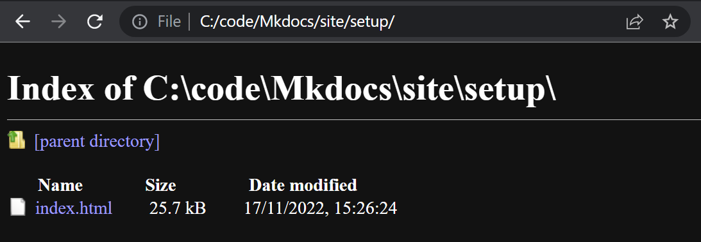

#Setup


In a video call, [Árni Björnsson](https://fabacademy.org/2022/labs/isafjordur/students/arni-bjornsson/) showed Móses and me how to set up MkDocs and Git. I've summarized all the steps here, with a few extra resources I found along the way:

##MkDocs setup from scratch
First, I installed the [VSCode](https://code.visualstudio.com/) code editor.

Then, as [Árni Björnsson](https://fabacademy.org/2022/labs/isafjordur/students/arni-bjornsson/) suggested, I created a folder called `code` directly in my C: drive, so that Dropbox and OneDrive don't try to sync the folder and mess up my GitHub connection.

I followed [this tutorial](https://www.mkdocs.org/user-guide/installation/) to set up MkDocs. There are a few steps to it:

1. It starts with installing the [Python extension for VSCode](https://marketplace.visualstudio.com/items?itemName=ms-python.python).
3. The `pip` package manager is included with the Python extension, but for some reason you don't always get the latest version. It may be a good idea to check the version. I opened a new terminal in the top menu in VSCode (`Terminal -> New Terminal`) and typed 
```
pip --version
pip 22.3.1 from C:\Users\your_username\AppData\Local\Programs\Python\Python310\lib\site-packages\pip (python 3.10)
```
and if it says it's out of date you can upgrade pip like this:
```
pip install --upgrade pip

```
2. Now it was time to install MkDocs:
```
pip install mkdocs
```
3. Then, as the tutorial suggests, I typed `mkdocs --version` to see if the installation went OK:
```
mkdocs --version
mkdocs, version 1.2.0 from /usr/local/lib/python3.8/site-packages/mkdocs (Python 3.8)
```
4. (optional) I also installed the [Material](https://squidfunk.github.io/mkdocs-material/) theme because it seemed nice and it includes expandable code annotations:
```
pip install mkdocs-material
```

!!! note
    To enable notes like this one in MkDocs, I added [Admonitions](https://squidfunk.github.io/mkdocs-material/reference/admonitions/) to the extensions in the mkdocs.yml file:
    ```yaml
    markdown_extensions:
        admonition
    ```
    Then, to create a note, start with `!!! note` and then indent the note text:
    ```
    !!! note
        Note text
    ```


### MkDocs test drive
I followed this [tutorial](https://squidfunk.github.io/mkdocs-material/creating-your-site/) to set up a small test website and get a live preview. 

1. After [installing](https://squidfunk.github.io/mkdocs-material/getting-started/) Material for MkDocs, I made a folder called Mkdocs. Then I opened a terminal and made sure that it was in the right folder:
```
cd C:\code\Mkdocs
```
Then I simply typed
```
mkdocs new .
```
and that was enough to create a simple site! Well, there are a few extra steps to view the site and deploy it, but this whole process is very simple.
2. Then I added the following lines to mkdocs.yml:
```yaml
theme:
  name: material
```
This is geared towards the Material theme for MkDocs, so if you're using a different theme, the only thing you need to change is the the theme line in the mkdocs.yml file.
3. Set up autocomplete. The [tutorial](https://squidfunk.github.io/mkdocs-material/creating-your-site/) suggests adding a line to settings.json, but it doesn't mention where that file is in VSCode. But it does provide a [link](https://code.visualstudio.com/docs/getstarted/settings) to instructions. You go into `File -> Preferences -> Settings`, scroll all the way down to Yaml: Schemas, and click `Edit in settings.json`.  Then you add the line `"https://squidfunk.github.io/mkdocs-material/schema.json": "mkdocs.yml"`, so in the end it looks like this:
``` yaml
{
    "workbench.colorTheme": "Default Dark+",
    "files.autoSave": "afterDelay",
    "yaml.schemas": {
        
        "https://squidfunk.github.io/mkdocs-material/schema.json": "mkdocs.yml"
    }
}
```
4. OK, now we're yearning for something to happen. Type the following into the terminal:
```
mkdocs serve
```
Now open your browser and write [localhost:8000](localhost:8000) in the address bar. Voilá! We have a live preview for an MkDocs website!

=== "Material theme"
    
=== "Default theme"
    

The source code for this site, written in Markdown, looks like this:

```
# Welcome to MkDocs

For full documentation visit [mkdocs.org](https://www.mkdocs.org).

## Commands

* `mkdocs new [dir-name]` - Create a new project.
* `mkdocs serve` - Start the live-reloading docs server.
* `mkdocs build` - Build the documentation site.
* `mkdocs -h` - Print help message and exit.

## Project layout

    mkdocs.yml    # The configuration file.
    docs/
        index.md  # The documentation homepage.
        ...       # Other markdown pages, images and other files.
```
As you can see, Markdown is simple and readable. Writing `#` gives you the biggest heading, `##` gives you heading 2, and so on. Put `*` in front of text to make a bullet point. To add a link, you do this: `[mkdocs.org](https://www.mkdocs.org)` and to add an image you do the same, but with an exclamation mark: ``
5. Finally, to build a static site, write this in the terminal:
```
mkdocs build
```
I tried this and got an index page that works fine. But when I clicked the Setup page (this page) I got this:

Hm. Apparently you need to put the structure of the site into your `mkdocs.yml` file to explicitly state the site navigation. So I opened it up and added
```
  nav:
    - 'index.md'
    - 'code.md'     # The code page is just a few code block tests in different languages.
    - 'setup.md'
```
No, that didn't work either. After some looking around I found a [solution](https://github.com/mkdocs/mkdocs/issues/2191). I added the following line to `mkdocs.yml`:
```
use_directory_urls: false
```
It works! And the first solution is unnecessary; MkDocs will infer the site navigation based on the pages you create in the docs folder.

Setting up MkDocs and getting the live preview working took me an hour in the morning. Writing up how I did it took me the rest of the day. It was a great way to learn Markdown. I like Markdown, with one exception; I don't have the ` symbol on my keyboard. I need to use that quite a lot for code snippets. Now this page serves as my reference in writing documentation.

!!! note
    To enable code highlighting (coloring the code, similar to how it looks in the VSCode editor), I added the following lines to `mkdocs.yml`:
    ```
    markdown_extensions:
    - pymdownx.highlight:
        anchor_linenums: true
    - pymdownx.inlinehilite
    - pymdownx.snippets
    - pymdownx.superfences
    - pymdownx.details
    ```
    I'm not sure if all these lines are necessary, but I'm just following this [tutorial](https://squidfunk.github.io/mkdocs-material/reference/code-blocks/). The last line comes from somewhere else, I don't remember where. Anyway, now I can make a code block by enclosing the code with ``` at the top and bottom and including the name of the language at the top:
    ```
        ```python
        # This program prints Hello, world!
        print('Hello, world!')
        ```
    ```
    This results in:
    ```python
    # This program prints Hello, world!
    print('Hello, world!')
    ```
    You can use this [reference](https://support.codebasehq.com/articles/tips-tricks/syntax-highlighting-in-markdown) to write the name of the programming language correctly at the top of your code block.

One more thing, I also added
``` yaml
markdown_extensions:
  - attr_list
  - md_in_html
```
to add the ability to align images, add captions and mark large images for lazy loading, as per this [tutorial](https://squidfunk.github.io/mkdocs-material/reference/images/).

## Customizing the theme

There is a way to toggle between light and dark mode. [This tutorial](https://squidfunk.github.io/mkdocs-material/setup/changing-the-colors/#color-palette-toggle) says that it's enough to copy the following code into `mkdocs.yml`:
=== "Light/dark toggle"
    ``` yaml
    theme:
        palette: 

        # Palette toggle for light mode
        - scheme: default
          toggle:
            icon: material/brightness-7 
            name: Switch to dark mode

        # Palette toggle for dark mode
        - scheme: slate
          toggle:
            icon: material/brightness-4
            name: Switch to light mode
    ```
=== "Light/dark toggle + Color change"
    ``` yaml
    theme:
        palette: 

        # Palette toggle for light mode
        - scheme: default
          toggle:
            icon: material/brightness-7 
            name: Switch to dark mode
          primary: red
          accent: red

        # Palette toggle for dark mode
        - scheme: slate
          toggle:
            icon: material/brightness-4
            name: Switch to light mode
         primary: red
          accent: red
    ```
``` title="Source code for the content tabs above"
    === "Light/dark toggle"
        ``` yaml
        theme:
            palette: 

            # Palette toggle for light mode
            - scheme: default
            toggle:
            icon: material/brightness-7 
                name: Switch to dark mode

            # Palette toggle for dark mode
            - scheme: slate
            toggle:
                icon: material/brightness-4
            name: Switch to light mode
        ```
    === "Light/dark toggle + Color change"
        ``` yaml
        palette: 

            # Palette toggle for light mode
            - scheme: default
            toggle:
                icon: material/brightness-7 
                name: Switch to dark mode
            primary: red
            accent: red

            # Palette toggle for dark mode
            - scheme: slate
            toggle:
                icon: material/brightness-4
                name: Switch to light mode
            primary: red
            accent: red
        ```
```
!!! note
    How to enable content tabs in `mkdocs.yaml`:
    ``` yaml
    markdown_extensions:
    - pymdownx.superfences
    - pymdownx.tabbed:
          alternate_style: true 
    ```
I also discovered that if you select a command, right click and select Change All Occurrences in VSCode, you only need to write the new color once, instead of four times. Nice!
Finally, I made a logo in Inkscape. I designed this logo in grade school, it's a kind of Icelandic rune that combines my initials S and K. Then I added two lines to `mkdocs.yml` to change the logo in the top left corner and also the favicon (the icon you see in the browser tab).
``` yaml
theme:
  logo: images\SK_logo.svg
  favicon: images\SK_logo.svg
```
First I wrote the path as `/images/SK_logo.SVG` and VSCode complained about the formatting. I found that you can right click the image and select Copy Relative Path to get the right formatting. That gave me `docs\images\SK_logo.svg`, which didn't work, but when I changed it to `images\SK_logo.svg` it worked.
I also enabled two [navigation](https://squidfunk.github.io/mkdocs-material/setup/setting-up-navigation/) options:
``` yaml
theme:
  features:
    - navigation.instant    # Instant loading (page behaves like a single-page application, search persists between pages)
    - navigation.tabs       # The pages are visible as tabs at the top instead of on the left hand side.
```

##GitHub setup
To set up a GitHub connection, I followed [this official VSCode tutorial](https://code.visualstudio.com/docs/sourcecontrol/github) and installed the [GitHub Pull Requests and Issues extension](https://code.visualstudio.com/docs/sourcecontrol/github). I was supposed to sign in but no sign in button appeared when I selected the GitHub icon in the left menu bar in VSCode. I did some more Googling and found an [unofficial tutorial](https://surajondev.com/2021/02/04/connect-your-github-to-vs-code/) that told me to sign in via the Accounts symbol in the bottom left corner of VSCode. I selected Turn on edit sessions sync and signed in with Github in a browser. Then I was redirected to VSCode, but that wasn't the end of it. I selected Accounts again and there an option to sign in to the Github extension appeared. I selected that, signed in in the browser and now I was finally signed in and could continue with the GitHub setup. But the [the official tutorial](https://code.visualstudio.com/docs/sourcecontrol/github) didn't tell me how to get files from my computer to GitHub. I needed to look elsewhere. I threw my hands up in the air and Googled ```i have code on my computer how do i create github repository```. The first result was [this official GitHub guide](https://docs.github.com/en/get-started/importing-your-projects-to-github/importing-source-code-to-github/adding-locally-hosted-code-to-github). The third step resulted in an error: `The token '&&' is not a valid statement separator in this version.` What then? I like MkDocs so far but I don't like Git so far. Let's see what [this tutorial](https://gist.github.com/RJ722/a9602ef70567ca65ce0ba698747c9fed) gets me:
```
PS C:\code\Mkdocs> git init -b main
Initialized empty Git repository in C:/code/Mkdocs/.git/
PS C:\code\Mkdocs> git status
On branch main

No commits yet

Untracked files:
  (use "git add <file>..." to include in what will be committed)
        docs/
        mkdocs.yml
        site/

nothing added to commit but untracked files present (use "git add" to track)
PS C:\code\Mkdocs> git commit
On branch main

Initial commit

Untracked files:
  (use "git add <file>..." to include in what will be committed)
        docs/
        mkdocs.yml
        site/

nothing added to commit but untracked files present (use "git add" to track) 
PS C:\code\Mkdocs> git push
fatal: No configured push destination.
Either specify the URL from the command-line or configure a remote repository using 

    git remote add <name> <url>

and then push using the remote name

    git push <name>
```
Sigh. Let's try to create a repository in the GitHub web interface and see if we can push these files to it.
```
PS C:\code\Mkdocs> git remote add Mkdocs https://github.com/svavarkonn/MkDocs       
PS C:\code\Mkdocs> git push Mkdocs
fatal: The current branch main has no upstream branch.
To push the current branch and set the remote as upstream, use

    git push --set-upstream Mkdocs main

To have this happen automatically for branches without a tracking
upstream, see 'push.autoSetupRemote' in 'git help config'.
```
What does upstream mean? OK, maybe I need to push specific files and folders inside the Mkdocs directory.
```
PS C:\code\Mkdocs> git remote add mkdocs.yml https://github.com/svavarkonn/MkDocs   
PS C:\code\Mkdocs> git remote add site https://github.com/svavarkonn/MkDocs
PS C:\code\Mkdocs> git remote add docs https://github.com/svavarkonn/MkDocs
```
Nothing. Nothing happened.
```
PS C:\code\Mkdocs> git push MkDocs
error: src refspec refs/heads/main does not match any
error: failed to push some refs to 'MkDocs'
```
So far, this is not fun.
### Page source
The Markdown code for the View page Source button is like this:
```
[View page source](setup.txt){ .md-button }
```
I'm going to put it on every page of my documentation. If you see an interesting element in the page, you can then easily see how to set it up. Pointing to a `.md` file doesn't work, so my workaround is to make a copy of the Markdown source file and change its extension to `.txt`.

I made a Python script using [this tutorial](https://datatofish.com/copy-file-python/) and put it in the MkDocs folder. The script copies all the .md files in the docs folder to another folder called textfiles and converts their extension to .txt.

To change the theme for just the home page, I followed tmeuze's advice in [this issue](https://github.com/squidfunk/mkdocs-material/issues/1996). To `mkdocs.yml` I added
``` yaml
    custom_dir: docs/overrides
```
and created a `docs/overrides` folder. Then I was unsure how to set up a custom theme, so I stopped there.

To enable the Github Repository button in the top right corner, I followed [this example](https://github.com/up42/up42-py/blob/master/mkdocs.yml) and added the following to my `mkdocs.yml`, just below `site_name`:
``` yaml
repo_name: Github Repository
repo_url: https://github.com/svavarkonn/MkDocs
```

I added
``` yaml
theme:
    features:
        - navigation.tracking
```
so that the URL in the address bar changes as you scroll down the page. If you copy the URL, the page will open in the section where you were when you copied it. Might be convenient if someone wants to cite something on this site.

I also added
``` yaml
theme:
    features:
        - navigation.tabs
        - navigation.tabs.sticky
```
to make the top navigation follow you as you scroll down the page.

By default, an "Edit this page" symbol is added to the right of the headline of every page. 

When you click it you just get a 404 error. I followed [this] to remove the edit button. I just add
``` css
<style>
  .md-content__button {
    display: none;
  }
</style>
```
to the .md file of each page and voilá! The edit button disappears.

[View page source](https://github.com/svavarkonn/MkDocs/blob/main/docs/setup.md?plain=1){ .md-button }

<style>
  .md-content__button {
    display: none;
  }
</style>